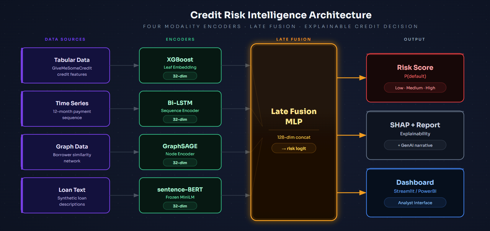

# 信用風險智能評估系統

**Streamlit Demo:** https://creditriskintelligence-jaxjumckv583zulzvweieh.streamlit.app/

> 一套結合結構化表格、月度時序、借款人關係圖與貸款文字描述的多模態信用風險分類系統，透過四個獨立 Encoder 的 Late Fusion 架構輸出違約機率、SHAP 可解釋性報告與 Claude Opus 4.7 信貸分析，適用於金融機構的輔助信貸審核情境。

---

## 專案亮點

- **四模態 Late Fusion 架構** — XGBoost（表格）、Bi-LSTM（時序）、GraphSAGE（圖）、sentence-BERT（文字）各自學習模態專屬表示，再於決策層拼接為 128 維向量，兼顧模態獨立性與跨模態推理
- **完整可解釋性鏈路** — XGBoost SHAP 在特徵層給出「哪個欄位推高了風險」，Fusion SHAP 在模態層給出「哪個 Encoder 貢獻最大」，Claude Opus 4.7 將上述結果翻譯成信貸員可讀的中文敘事報告
- **模組化 Pipeline，實際資料可無縫替換** — 每個 Encoder 以固定的 (batch, 32) 向量介面對外，合成資料換成真實還款紀錄、CRM 關係圖、真實申請書時，Fusion 層完全不需修改

---

## 系統架構



---

## 技術棧

| 分類 | 技術 | 用途 |
|---|---|---|
| 表格模型 | XGBoost | Tabular baseline + leaf embedding |
| 深度學習框架 | PyTorch | LSTM、Fusion MLP 訓練 |
| 圖神經網路 | PyTorch Geometric (PyG) | GraphSAGE 節點 Embedding |
| 自然語言處理 | sentence-transformers | 凍結 all-MiniLM-L6-v2 文字 Encoder |
| 可解釋性 | SHAP | 特徵貢獻度分析與視覺化 |
| 實驗追蹤 | MLflow | AUC、Loss 曲線記錄 |
| 前端介面 | Streamlit | 互動式信貸評估 Dashboard |
| 生成式 AI | Anthropic Claude Opus 4.7 | SHAP 驅動的中文信貸報告生成 |
| 資料處理 | pandas、scikit-learn | 清洗、特徵工程、評估指標 |

---

## 實驗結果

| 模組 | 方法 | Val AUC | 備註 |
|---|---|---|---|
| Tabular Baseline | XGBoost | 0.67 | 1,200 row 樣本，40% 正例率（非原始 6.7%）|
| 時序模組 | Bi-LSTM (PyTorch) | 0.72 | 合成時序，12 月滑動視窗 |
| 圖模組 | GraphSAGE (PyG) | 0.74 | 合成相似圖，threshold=0.85 |
| 文字模組 | frozen sentence-BERT | — | 固定 Encoder，不評估單獨 AUC |
| 融合模型 | Late Fusion MLP | — | 需完整 150K 資料集重測 |

> **注意：** 本 demo 使用的 `cs-training.csv` 為 1,200 筆樣本檔，正例率 40.2%，與原始 GiveMeSomeCredit（150K 筆，6.7% 正例率）的分佈不同。所有數字為架構驗證用，不代表在真實信貸資料上的預測表現。

---

## 圖模型統計

| 指標 | 數值 |
|---|---|
| num_nodes | 840 |
| num_edges | 10,408 |
| avg_degree | 12.39 |
| density | 0.01477（稀疏圖） |
| is_connected | True（單一連通分量） |

---

## 如何執行

```bash
# 1. 取得程式碼與安裝相依套件
git clone https://github.com/JoeyTaipei/Credit_risk_intelligence.git
cd credit-risk-intelligence
pip install -e .

# 2. 設定環境變數
cp .env.example .env
# 編輯 .env，填入 OPENAI_API_KEY=sk-...

# 3. 下載資料（需 Kaggle API Token）
python -m src.data.download --target all

# 4. 訓練各模組
python -m src.training.train_loop --stage xgb
python -m src.training.train_loop --stage lstm
python -m src.training.train_loop --stage gnn
python -m src.training.train_loop --stage text
python -m src.training.train_loop --stage fusion

# 5. 啟動 Streamlit 介面
streamlit run app/streamlit_app.py
```

---

## 專案結構

```
credit-risk-intelligence/
├── app/
│   └── streamlit_app.py          # 互動式 Dashboard
├── data/
│   ├── raw/                      # GiveMeSomeCredit CSV
│   ├── processed/                # 訓練產物 (.parquet, .pt, .pkl)
│   └── synthetic/                # 合成貸款說明文字
├── docs/
│   ├── ADR.md                    # 5 項架構決策紀錄
│   ├── architecture.md           # 系統架構與模組職責表
│   ├── data_strategy.md          # 四模態資料策略
│   └── 面試講法_complete.md      # 面試答題速查
├── src/
│   ├── data/
│   │   ├── preprocess.py         # 清洗、時序生成
│   │   ├── graph_builder.py      # 借款人相似圖建構
│   │   └── text_preprocessor.py # 文字對齊與備援邏輯
│   ├── models/
│   │   ├── xgb_baseline.py       # XGBoost + SHAP
│   │   ├── lstm_encoder.py       # Bi-LSTM Encoder
│   │   ├── gnn_encoder.py        # GraphSAGE Encoder
│   │   ├── text_encoder.py       # sentence-BERT 投影頭
│   │   └── fusion.py             # Late Fusion MLP + leaf embedding
│   ├── training/                 # 各模態訓練入口
│   ├── inference/                # 單筆推論、SHAP、報告生成
│   └── utils/                    # SHAP 視覺化、Claude Opus 封裝
├── tests/
├── pyproject.toml
└── requirements.txt
```

---

## 設計決策

詳見 [docs/ADR.md](docs/ADR.md)，涵蓋五項關鍵架構決策：

1. **Late fusion over early fusion** — 保留各模態的歸納偏置，支援 Modality 缺失的優雅降級
2. **GraphSAGE over GAT** — Inductive learning，新借款人無需重新訓練
3. **Frozen sentence-BERT** — 合成資料量不足以 fine-tune，projection head 足夠學習信用相關方向
4. **LSTM over Transformer** — 12 步短序列不需要 Transformer 的複雜度
5. **合成資料的誠實邊界** — AUC 數字反映 data generator 邏輯，架構才是核心貢獻

---

## 作者

**Joey Wu (巫佳樺)**
Georgia Tech OMSA | [github.com/JoeyTaipei/Credit_risk_intelligence](https://github.com/JoeyTaipei/Credit_risk_intelligence)
