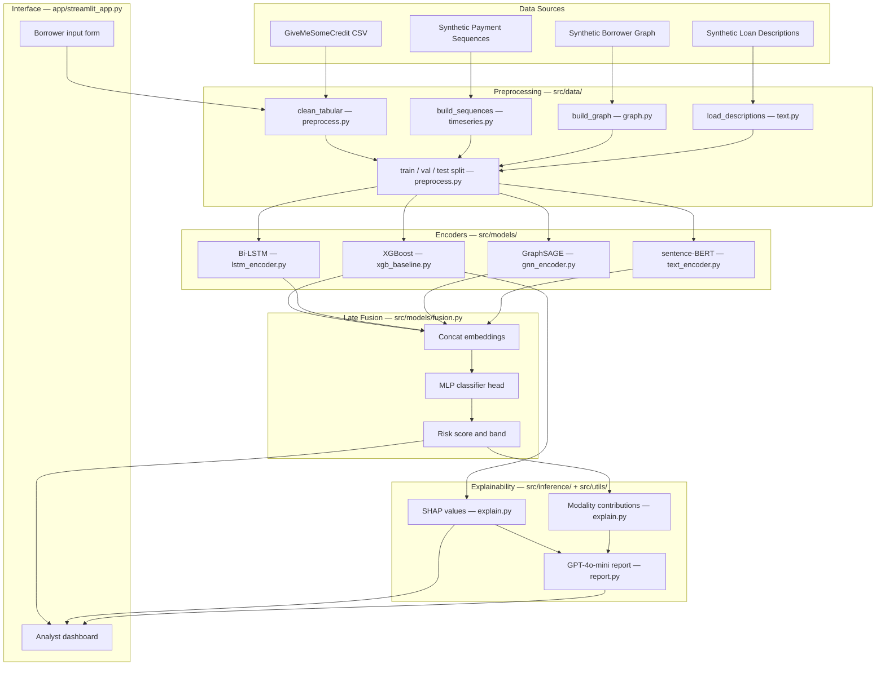

# Architecture

**System:** Multi-Modal Credit Risk Intelligence
**Date:** 2026-05-08

---

## 1. System Overview

Credit Risk Intelligence is a multi-modal default prediction platform that combines four distinct borrower signals — structured tabular features, monthly payment sequences, co-borrower relationship graphs, and loan purpose text — into a single probability-of-default score and analyst-readable explanation. Raw GiveMeSomeCredit tabular data and three synthetically generated modalities are each cleaned and shaped by dedicated preprocessing modules, then encoded by modality-specific models (XGBoost, Bi-LSTM, GraphSAGE, frozen sentence-BERT) into fixed-length embedding vectors. Those embeddings are concatenated and passed through a late-fusion MLP classifier, whose output feeds a SHAP explainer and a GPT-4o-mini report generator before surfacing to the Streamlit analyst dashboard.

---

## 2. Pipeline Diagram

---

## 3. Module Responsibility Table

| File path | Responsibility | Day |
|---|---|---|
| `src/__init__.py` | Mark source tree as importable package | 0 |
| `src/data/__init__.py` | Expose data module package boundary | 0 |
| `src/models/__init__.py` | Expose model module package boundary | 0 |
| `src/training/__init__.py` | Expose training module package boundary | 0 |
| `src/inference/__init__.py` | Expose inference module package boundary | 0 |
| `src/utils/__init__.py` | Expose utility module package boundary | 0 |
| `src/data/download.py::download_credit_dataset` | Download and unzip GiveMeSomeCredit from Kaggle | 0 |
| `src/data/download.py::generate_synthetic_loan_descriptions` | Generate synthetic loan-purpose narratives | 0 |
| `src/utils/config.py` | Centralize paths, env vars, and runtime settings | 1 |
| `src/utils/seed.py` | Set deterministic seeds across Python, NumPy, and PyTorch | 1 |
| `src/utils/logging.py` | Consistent INFO/ERROR console logging helpers | 1 |
| `src/utils/io.py` | Read and write datasets, models, embeddings, and reports | 1 |
| `src/utils/metrics.py` | AUC, precision, recall, F1, KS, and calibration metrics | 1 |
| `src/data/preprocess.py::clean_tabular` | Clean GiveMeSomeCredit: impute, clip, rename columns | 1 |
| `src/data/preprocess.py::make_train_test_split` | Reproducible stratified train / val / test split | 1 |
| `src/data/features.py` | Build reusable tabular feature matrices and label vectors | 1 |
| `src/models/xgb_baseline.py` | Train and evaluate the XGBoost tabular encoder | 1 |
| `src/training/train_xgb.py` | CLI entrypoint for baseline training and artifact export | 1 |
| `src/data/timeseries.py` | Generate borrower payment sequences and padded tensors | 2 |
| `src/models/lstm_encoder.py` | Bi-LSTM module that outputs a fixed borrower embedding | 2 |
| `src/training/train_lstm.py` | Train LSTM encoder and export sequence embeddings | 2 |
| `src/data/graph.py` | Build cosine-similarity graph: edges, node features, masks | 3 |
| `src/models/gnn_encoder.py` | GraphSAGE module that outputs per-node embeddings | 3 |
| `src/training/train_gnn.py` | Train graph encoder and export node embeddings | 3 |
| `src/data/text.py` | Load, validate, and join loan descriptions to borrower IDs | 4 |
| `src/models/text_encoder.py` | Frozen sentence-BERT wrapper that batch-encodes descriptions | 4 |
| `src/training/embed_text.py` | Batch-generate and persist sentence embeddings | 4 |
| `src/models/fusion.py` | Concat modality embeddings; MLP classifier head | 5 |
| `src/training/train_fusion.py` | Train late-fusion classifier and save final model artifact | 5 |
| `src/inference/predict.py` | Single-borrower inference across all four modalities | 6 |
| `src/inference/explain.py` | SHAP values and per-modality contribution summaries | 6 |
| `src/inference/report.py` | GPT-4o-mini analyst narrative grounded in SHAP evidence | 6 |
| `src/utils/shap_visualizer.py` | Render SHAP waterfall and summary plots for Streamlit | 6 |
| `src/utils/openai_report.py` | OpenAI API wrapper with prompt template and retry logic | 6 |
| `app/streamlit_app.py` | Borrower input form, dashboard, score, drivers, report | 7 |

---

## 4. Data Flow Narrative

Training begins with `cs-training.csv` from GiveMeSomeCredit and the pre-generated `data/synthetic/loan_descriptions.csv`. The preprocessing layer — `clean_tabular`, `build_sequences`, `build_graph`, and `load_descriptions` — converts each raw source into a borrower-keyed representation and then calls `make_train_test_split` once to create a shared, stratified partition that all four encoders use. From that split, the system prepares four parallel views: a normalized tabular feature matrix for XGBoost, padded monthly payment tensors for the Bi-LSTM, a PyG `Data` object with node features and edge index for GraphSAGE, and sentence embeddings generated offline by the frozen sentence-BERT wrapper. Each encoder produces a fixed-length vector keyed by borrower ID, so the fusion stage joins modalities without coupling to any encoder's internal implementation.

Inference follows the same contracts on a single new borrower. The Streamlit form collects structured fields, optional repayment history, optional relationship context, and a short loan description, then routes each input through the same preprocessing functions used during training. The four encoders generate modality-specific embeddings, the fusion MLP produces a probability of default and maps it to a risk band (Low / Medium / High / Very High), and `explain.py` computes SHAP values on the tabular encoder output alongside a modality-level contribution summary. Those grounded facts — not free-form generation — are passed as context to `report.py`, which calls GPT-4o-mini to produce a concise analyst narrative; the LLM cannot introduce unsupported claims because its prompt constrains it to the evidence already computed.

This structure keeps maintenance and debugging tractable because every stage has a narrow, inspectable contract. Data modules own schemas and joins; model modules own representation learning; training modules own reproducible artifact creation; inference modules own runtime orchestration. If sentence-BERT embeddings look wrong, `embed_text.py` can be re-run independently without touching the LSTM. If SHAP output is unexpected, the XGBoost feature matrix can be audited without re-running fusion. Late fusion also allows the project to ship useful milestones incrementally: the Day 1 XGBoost baseline is already a working credit model, and each subsequent encoder can be plugged in, benchmarked, and disabled without rewriting the pipeline.
