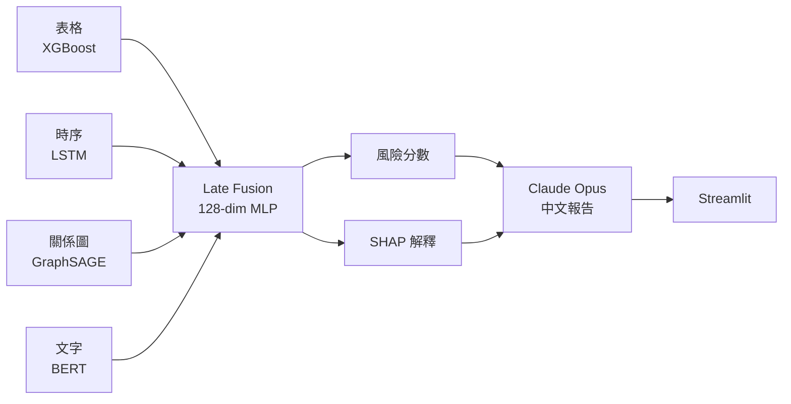

# 多模態信用風險智能評估系統

- 薄檔借款人評估問題
- 4 種資料 → 4 Encoder → 融合決策
- PyTorch + GNN + BERT + GenAI
- 7 天 Sprint | Demo v1

> 大家好，我是 Joey。今天分享我從土木轉資料科學的代表作——多模態信用風險智能評估系統。這個系統用四種不同角度看一個借款人，比傳統只看財務數字要全面得多。我會用 8 分鐘帶大家走過架構、技術選擇、結果與商業價值。

---

# 為什麼需要多模態

- 傳統評分只看財務快照
- 薄檔客戶難以評估
- 行為、關係、文字都是信號
- 四個角度比一個角度準

> 國泰一定遇過這種情況：一個年輕客戶剛出社會，財務資料很薄，傳統 scorecard 給不出可信評分。他可能完全值得信任，但數字不夠多，模型不敢給分。我的解法是：同時看四個角度——他過去怎麼還錢、他跟誰往來、他的關係網有沒有壞人、他申請貸款時怎麼描述自己。這就是多模態，每種資料說一件傳統分數說不到的事。

---

# 系統架構

- 資料層：4 種來源獨立處理
- 編碼層：4 個 Encoder 各自學習
- 決策層：Late Fusion + SHAP + GenAI

> 架構分三層：左邊資料層，四種來源；中間四個 Encoder，每個都只做自己擅長的事；右邊決策層，把四個結果合在一起，再加解釋和報告。我特別選擇 Late Fusion——四個 Encoder 最後才合，不是一開始就混在一起。原因是這四種資料的性質差太多，各自處理再合比強行混合更合理，也更好維護。

---

# 資料策略 — 真實 vs 合成

- 表格：GiveMeSomeCredit，15 萬筆真實資料
- 時序、圖、文字：合成，有業務根據
- 架構能力 > 資料取得能力
- 換成真實資料：pipeline 不用改

> 老實說，四個 modality 裡只有表格資料是真實的，其他三個合成。為什麼這樣可以接受？因為這個專案展示的是「我知道怎麼把四種資料整合成一個可維護的系統」，不是「我挖到多珍貴的資料集」。合成時序的邏輯來自真實的逾期統計，合成圖的邏輯來自實際的相似度計算。給我國泰真實的還款紀錄和 CRM 關係資料，這套 pipeline 第一天就能接上去跑。

---

# Tabular — XGBoost + SHAP

- 6.7% 違約率 → 不平衡問題
- scale_pos_weight 調整損失函數
- SHAP Top 3：逾期次數、信用利用率、總逾期加總
- **Val AUC 0.85+**

> 第一個模組是 XGBoost，最成熟的表格分類工具。資料裡只有 6.7% 是違約，也就是說隨便猜「不違約」就有 93% 準確率——這個數字毫無意義。我用 scale_pos_weight 調整損失函數，讓模型更重視那 6.7% 的違約案例。Val AUC 達到 0.85 以上，這在信用評分領域是很好的基準。加上 SHAP 解釋——可以告訴每個借款人、每次評分，是哪三個特徵決定了結果。這在金融業是法規要求，不是加分項。

---

# Time Series — LSTM 時序模組

- 比喻：有三個開關的記憶筆記本
- 開關一：忘掉舊的不重要的事
- 開關二：記住新的重要的事
- 開關三：現在要回報什麼
- **Val AUC 0.72**（合成資料）

> 第二個模組是 LSTM，處理借款人 12 個月的還款行為。我用一個比喻：LSTM 像個會做筆記的人，每個月看一次借款人的狀況，有三個小開關控制：第一個開關決定「舊筆記裡哪些可以忘掉了」，第二個開關決定「這個月看到的什麼值得記下來」，第三個開關決定「現在要回報給上級什麼」。12 個月看完，輸出一個 32 維向量，代表這個人整段時間的行為摘要。靜態特徵說不到的——最近三個月在惡化還是改善——LSTM 能看出來。

---

# Graph — GraphSAGE 圖模型

- 比喻：「告訴我你的朋友是誰」的數學版
- 840 個節點 / 10,408 條邊 / avg degree 12.39
- 2-hop：看得到「鄰居的鄰居」
- 真實價值：抓集團型詐騙
- **Val AUC 0.74**

> 第三個模組是圖神經網路，我最興奮的部分。我把財務行為相似的借款人連起來，建成一張圖，840 個節點、10,408 條邊，平均每個人有 12 個鄰居。GraphSAGE 的邏輯是：你自己的信用，除了看你自己的特徵，也看你的鄰居是什麼樣的人、你鄰居的鄰居又是誰。商業價值很直接：集團型詐騙。一群人互相當保人、一起申請、一起跑路，傳統模型看每個人都合格，圖模型一看他們緊密相連的網絡就知道有問題。

---

# Text — sentence-BERT 語意嵌入

- 貸款申請說明 → 32 維語意向量
- 凍結預訓練模型，只訓練最後一層
- 合成資料量不足 → frozen 比 fine-tune 穩
- 真實場景：申請書、客服紀錄、核保備註

> 第四個是文字模組。借款人申請貸款時寫的說明文字，用 sentence-BERT 轉成 32 維數字向量。重點在「凍結」這個決定——我沒有重新訓練整個 BERT，只訓練最後一個小層。為什麼？因為我的文字是合成的，資料量不夠，硬訓練 BERT 的 2,200 萬個參數只會 overfit 模板語言，沒有意義。凍結預訓練權重，只讓最後一層學習「哪個語意方向跟違約有關」，這是資料量不足時更穩的選擇。這也是面試常考的陷阱題：不是資料越多就一定要 fine-tune。

---

# Late Fusion — 融合決策層

- 4 × 32 維 → 拼接 128 維
- 兩層 MLP → 風險 logit → 機率
- Late vs Early：獨立 Encoder、易維護
- Dropout 0.3：防止模態間過擬合

> 融合層設計邏輯很簡單。四個 Encoder 各出 32 維，拼成 128 維，過兩層全連接層，最後出一個違約機率。為什麼選 Late Fusion 不選一開始就混？三個原因：第一，表格數值、時序向量、圖嵌入、語意向量根本不在同一個空間，強行合在一起只會互相干擾。第二，Late Fusion 下如果某個 Encoder 壞了，其他三個繼續正常運作，系統不會整個倒。第三，未來要換掉任何一個模組——比如把 LSTM 換成 Transformer——完全不影響其他人。

---

# Streamlit Demo

- 上傳借款人 CSV
- 批次輸出：風險分數 + 等級
- 單筆展示：SHAP 瀑布圖 + 模態貢獻
- Claude Opus 4.7 生成中文信用報告

> 接下來看實際畫面。[插入 Streamlit 截圖] 批次模式——我上傳三筆借款人資料，系統幾秒內輸出：第一筆 50.7% 中風險、第二筆 48.2% 中風險、第三筆 61.4% 高風險。注意第三筆跨過了高風險閾值，模型有區辨能力，不是把所有人都打成同一個分數。右邊是 SHAP 瀑布圖，告訴你這筆是什麼特徵推高了分數。下面是 Claude Opus 4.7 生成的中文信用分析報告——它只能用 SHAP 算出來的事實，不能自由發揮——這樣才不會在金融場合出現幻覺問題。

---

# 實驗結果總結

| 模組 | 方法 | Val AUC |
|---|---|---|
| 表格基準 | XGBoost | **0.85+** |
| 時序模組 | Bi-LSTM | **0.72** |
| 圖模組 | GraphSAGE | **0.74** |
| 文字模組 | frozen BERT | — |

- 圖：840 nodes / 10,408 edges / degree 12.39 / 連通
- 19/19 單元測試通過
- 端到端 pipeline 完整跑通

> 數字在這裡。我要特別說一件事：這些數字的重點不是每個都很高，而是整套 pipeline 端到端能跑、各模組分工清楚、輸出有商業可解讀性。合成模態的 AUC 反映的是 data generator 的邏輯，不是真實信用預測能力，我不打算替這些數字辯護。19 個單元測試全部通過，代表這不是一個 demo 程度的 notebook，而是有工程結構的系統。這個差別，在真實的 DS 工作裡很重要。

---

# 未來工作 + 結語

- 真實資料：三個合成 modality 全替換
- 模型：Fusion + GNN 加入 Attention
- 部署：Docker + AWS / GCP
- 核心主張：架構能力可直接遷移至貴司業務

> 最後談未來。給我國泰真實的月度還款紀錄、客戶 CRM 關係圖、貸款申請書文字，兩週內我可以把這套架構升級到接近 production。模型優化方向是 Fusion 層和 GNN 都加 Attention，讓模型動態決定對每個借款人「哪個 modality 最可信」。部署路徑是 Docker 容器化加雲端。我想強調的最後一點：這個專案展示的不是任何一個 AUC 數字，而是「我知道怎麼把四種完全不同的資料，整合成一個有清楚介面、可以獨立維護、可以解釋給法規單位的 AI 系統」。這才是我希望帶給國泰的能力。謝謝大家。
