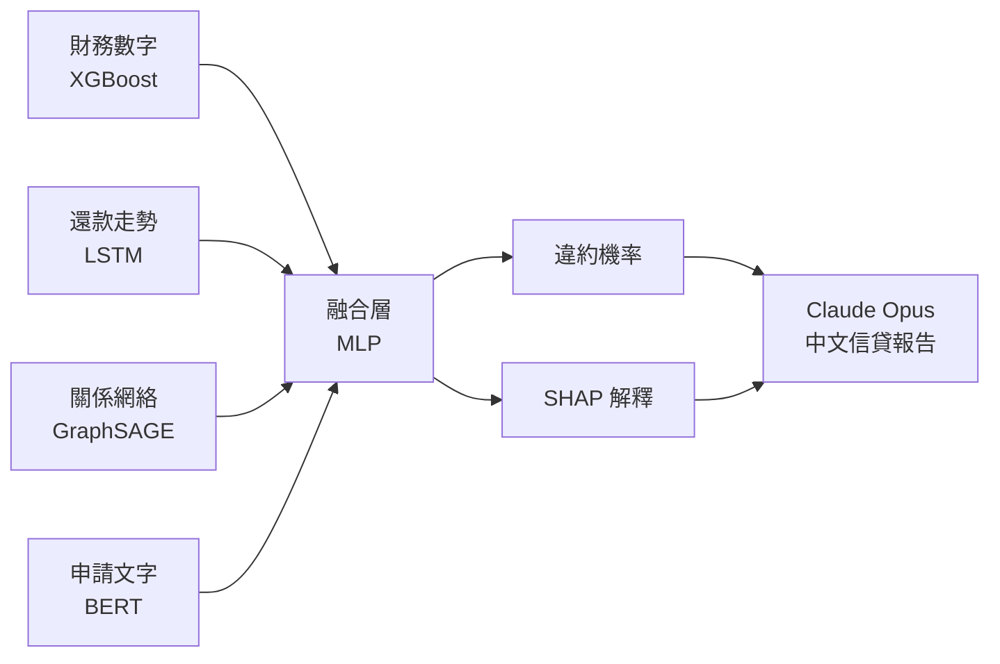

# 信用風險評估的下一步

- 一個業務問題：薄檔客戶怎麼給分？
- 一套解法：四種資料角度同時看
- 一個目標：可解釋、可部署、信貸員真的能用

> 大家好，我是 Joey，背景是土木工程轉資料科學。今天想跟大家分享的，不只是一個模型，而是我對一個金融業真實痛點的完整思考過程——從問題定義、到架構選擇、到落地輸出。我盡量用 8 分鐘讓大家看到：這套系統的每一個設計決定，背後都有業務理由。

---

# 問題：傳統信用評分的盲區

- 只看「現在」，看不到「趨勢」
- 只看「個人」，看不到「群體風險」
- 薄檔客戶沒有歷史 ≠ 高風險
- 損失：好客戶被拒、壞客戶被放行

> 先定義問題。傳統 scorecard 拿的是一個時間點的靜態快照——你現在欠多少、歷史逾期幾次。但有兩個盲區。第一，它看不到趨勢：同樣是逾期兩次，三年前的舊帳跟最近三個月連著逾期，風險完全不同。第二，它把每個人當孤立個體：詐欺很少是一個人幹的，通常是一群人一起申請一起跑，傳統模型看每個人都合格，就全批了。這兩個盲區不是小問題——它直接影響核准率的品質。

---

# 診斷：我們缺少的三種資訊

- 行為隨時間的變化
- 借款人之間的關係網絡
- 申請人自己說了什麼

> 我的診斷是：問題不在演算法不夠強，而在輸入的資訊本來就不完整。銀行其實有這些資料——每月還款紀錄、客戶關係、貸款申請書——只是傳統系統沒有用進去。所以我的假設是：如果同時看四種角度，能不能做出更準的判斷？財務數字是一個角度、還款行為的走勢是第二個、他跟誰往來是第三個、他申請時說了什麼是第四個。這四個加在一起，才是一個完整的借款人輪廓。

---

# 解法架構：四個角度，一個決策

- 每種資料進一個專屬模型
- 各自輸出 32 維的「借款人特徵向量」
- 四個向量合併 → 一個風險分數
- 全程附 SHAP 解釋 + AI 中文報告

> 架構的設計原則很簡單：每種資料用最適合它的工具來處理，最後再合在一起。不是一開始就把所有資料混在一個大模型裡——那樣的話，各種資料的特性會互相干擾，而且某個來源壞掉的時候整個系統就倒了。我選擇「後期融合」——各自做好，最後決策層才合併——這樣每個模組可以獨立維護、獨立更新，系統韌性更高。

---

# 資料說明：誠實比包裝重要

- 財務數字：GiveMeSomeCredit，15 萬筆，真實
- 還款走勢、關係圖、申請文字：合成
- 合成邏輯有業務根據，不是隨機生成
- 換成真實資料：三個模組的架構不用改

> 在進到每個模組之前，我想先把一件事說清楚：四個模組裡只有財務數字那個用的是真實資料，其他三個是合成的，因為還款紀錄、CRM 關係、申請書文字都是機構私有資料，我拿不到。但我合成的方式有根據——時序是從真實逾期統計推算出來的，不是亂數。這個專案要展示的，是「我知道怎麼設計這套系統」，而不是「我有多珍貴的資料集」。如果貴司願意提供真實資料，這三個模組的換法我很清楚，兩週內可以接上去。

---

# 財務數字分析：XGBoost + SHAP

**業務問題：** 6.7% 違約率，模型怎麼找出那 6.7%？

**做法：** XGBoost + 損失函數加權 → AUC **0.85+**

**關鍵決定：** 加 SHAP，每筆都解釋原因

**業務價值：** 符合金融法規，信貸員可審查

> 第一個模組，財務數字分析。問題是資料只有 6.7% 是違約，如果模型全猜「不違約」準確率也有 93%，但這樣完全沒用。我的做法是在損失函數裡給違約案例更高的懲罰權重，讓模型不敢忽視那 6.7%。AUC 達到 0.85 以上。更重要的是 SHAP——每一筆預測，系統都說得出「是哪三個特徵決定了這個分數」。在金融業，這不是加分的功能，是法規要求：你拒絕一個人的貸款，你要能說出理由。

---

# 還款走勢分析：時序模型

**業務問題：** 最近三個月惡化，比三年前逾期更危險

**做法：** LSTM 讀 12 個月走勢 → AUC **0.72**

**簡單理解：** 模型記住每個月看到什麼，最後給出摘要

**業務價值：** 抓早期惡化信號，比靜態特徵早一步

> 第二個模組，還款走勢。這解決了靜態快照的問題。我的比喻是：LSTM 就像一個每個月做一次紀錄的信貸員，他有三個小動作——第一，決定上個月的筆記哪些可以丟掉；第二，決定這個月看到的什麼值得寫進去；第三，決定現在要跟上級回報什麼。12 個月做完，給出一份摘要向量。這個摘要能告訴你：這個人是一直很穩、還是最近三個月突然開始出問題。靜態的逾期次數特徵抓不到這個，這個模組可以。

---

# 關係網絡分析：圖模型

**業務問題：** 集團型詐騙，傳統模型每個人看起來都合格

**做法：** 相似借款人連成圖，模型看鄰居 → AUC **0.74**

**簡單理解：** 你朋友是誰，決定你的風險分數

**業務價值：** 抓傳統模型完全看不到的群體風險

> 第三個模組是我最有感觸的。集團型詐騙的特點是：一群人互相當保人，個別看都符合申請條件，傳統模型全部批准，然後他們一起跑路。我的解法是把相似的借款人連成一張圖，讓模型看你的鄰居是什麼樣的人。如果你的鄰居的鄰居裡有幾個高風險的，你的風險評分也會被拉高。這個圖有 840 個節點、10,408 條邊、平均每個人連到 12 個人。AUC 0.74，但在合成資料下，更重要的是這個架構能不能在真實 CRM 資料上部署——可以。

---

# 申請文字分析：語意模型

**業務問題：** 申請人說了什麼？和行為一致嗎？

**做法：** 凍結 BERT，只訓練最後一層投影

**關鍵決定：** 資料量不足時 frozen 比 fine-tune 更穩

**業務價值：** 挖掘申請書、客服紀錄、核保備註的隱含信號

> 第四個是文字模組。貸款申請書裡借款人寫的用途、還款計畫，這些文字包含的信號傳統系統完全沒用到。我用一個預訓練的語意模型把這段文字轉成數字向量。這裡有一個關鍵設計決定：我沒有重新訓練整個模型，而是把它「凍結」，只讓最後一層學習「哪個語意方向跟違約相關」。為什麼？因為合成文字的量不夠，硬訓練反而 overfit。這是一個資料量不足時的正確選擇。到了真實場景，這個模組可以接申請書、客服紀錄、甚至核保備註。

---

# 系統 Demo

- 上傳借款人資料 CSV
- 輸出：風險分數 + 低/中/高分級
- SHAP 圖解釋每筆決策原因
- Claude Opus 自動生成中文信用報告

> 來看實際輸出。[插入 Streamlit 截圖] 我上傳三筆借款人資料，系統幾秒內給出：第一筆 50.7% 中風險、第二筆 48.2% 中風險、第三筆 61.4% 高風險。第三筆跨過高風險閾值——模型有區辨能力，不是給所有人同樣的分數。右邊的 SHAP 圖說明這筆為什麼評這個分：哪個特徵推高了、哪個拉低了，信貸員一眼就能看懂。下面是 Claude Opus 生成的中文報告，用人話把 SHAP 的結果說出來。我要強調一點：AI 在這裡只能引用 SHAP 算出的事實，不能自由發揮——這是金融場景裡避免幻覺的正確做法。

---

# 結果與業務意涵

| 模組 | 評估指標 | 說明 |
|---|---|---|
| 財務分析 | AUC **0.85+** | 真實資料，可信 |
| 走勢分析 | AUC **0.72** | 合成，架構驗證 |
| 關係網絡 | AUC **0.74** | 合成，架構驗證 |
| 文字分析 | — | 換真實資料才評估 |

- 19/19 單元測試通過
- 端到端：資料進，報告出，全自動
- 可解釋性：每筆決策都有 SHAP 根據

> 結果總結。財務數字的 0.85+ 是在真實資料上測的，這個數字有意義。另外兩個是合成資料，它們的意義是「架構能跑」，不是「預測能力有多強」——我不打算替這兩個數字辯護太多。真正想讓大家帶走的訊息是：這套系統從資料進到報告出，全程自動，全程可解釋，19 個單元測試全部通過，這不是一個 Jupyter Notebook，這是一個可以繼續工程化的系統。

---

# 如果貴司給我真實資料

- 兩週：三個合成模組換成真實來源
- 一個月：接上核心系統，壓力測試
- 長期：Attention Fusion，動態模態信任權重

> 最後我想說得直接一點。這套系統今天的限制很清楚——三個模組用合成資料。但架構的選擇是為真實場景設計的：時序模組接真實還款紀錄、圖模組接 CRM 擔保人關係、文字模組接申請書。這些替換的方式我很清楚，工程介面也設計好了，不需要重寫整個系統。如果貴司有這些資料，我想展示的不只是這個 demo 能跑，而是「我能把它推到 production」的能力。謝謝大家，期待接下來的討論。
