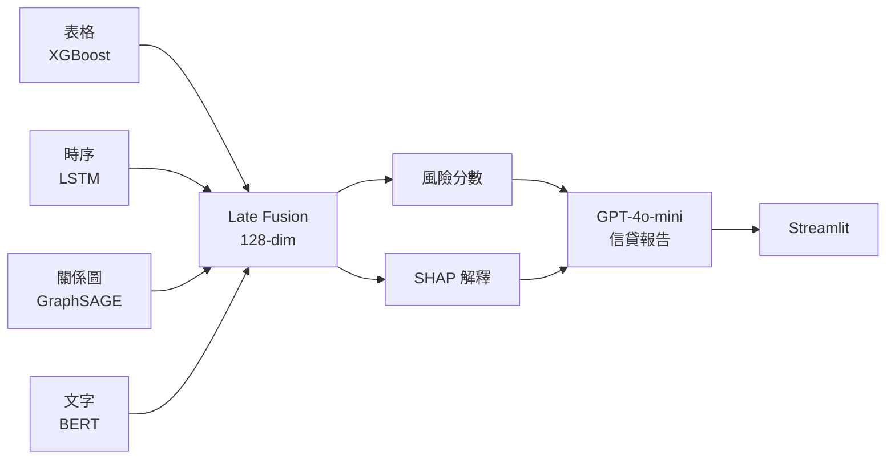

# 簡報腳本：多模態信用風險智能評估系統
**場合：** 國泰人壽 AI Data Science 團隊
**總時長：** 8 分鐘 + Q&A
**版本：** Demo v1 | 2026-05-08

---

# Slide 1: 封面
**時間：30 秒**

- 多模態信用風險智能評估系統
- XGBoost × LSTM × GraphSAGE × sentence-BERT → Late Fusion
- Joey Wu（巫佳樺）| Georgia Tech OMSA
- 7-Day Sprint Demo

**說話稿：**
大家好，我是 Joey Wu，今天要跟大家分享的是我這七天做的一個專案——多模態信用風險智能評估系統。簡單說就是：把四種不同的借款人資料合在一起，讓模型做出更完整的信用評估，最後輸出一份信貸人員看得懂的風險報告。接下來八分鐘，我會帶大家走過整個系統，從問題定義到 Live Demo。

---

# Slide 2: 問題定義
**時間：40 秒**

- 傳統信用評分：只看靜態表格快照
- 薄檔借款人：缺乏歷史紀錄，不等於高風險
- 單一模型的盲點：動態行為、群聚詐欺、申請意圖
- 解法：整合四種資料，讓每種資料說它最擅長說的話

**說話稿：**
先從問題說起。傳統信用評分——像 FICO——只看一個時間點的靜態數據：你現在欠多少、歷史逾期幾次。但這有兩個根本問題。第一，它看不到趨勢——同樣是逾期兩次，三年前的舊帳跟最近三個月連續逾期，風險完全不一樣。第二，它把每個借款人當作獨立個體，看不到群聚詐欺——詐欺往往是一圈人一起出事，傳統模型完全看不見。所以我的問題是：如果我們同時有表格數據、還款時序、社交關係、和貸款申請文字，能不能把它們整合起來，做出更全面的判斷？

---

# Slide 3: 系統架構總覽
**時間：50 秒**

- 四種資料模態 → 四個獨立 Encoder
- 每個 Encoder 輸出 32 維 Embedding
- Late Fusion：拼接為 128 維 → MLP 分類器
- 輸出：違約機率 + SHAP 解釋 + GPT-4o-mini 報告

**說話稿：**
這是整個系統的架構。左邊是四種資料來源，各自進一個對應的 Encoder——表格用 XGBoost、時序用 LSTM、關係圖用 GraphSAGE、文字用 sentence-BERT。每個 Encoder 輸出一個 32 維的向量，四個向量拼接成 128 維，再進一個 MLP 分類器。這個設計叫做 Late Fusion——每個模型先在自己的領域學好，最後才在決策層合在一起。輸出三樣東西：違約機率、SHAP 可解釋性、和 GPT-4o-mini 生成的中文信貸報告。

---

# Slide 4: 資料說明
**時間：40 秒**

- 真實資料：GiveMeSomeCredit（Kaggle）150K 借款人，6.7% 違約率
- 合成資料：時序、圖、文字——三種模態
- 為什麼可以接受：架構是目標，數字不是
- 真實銀行本就有這四種資料，pipeline 可直接替換

**說話稿：**
資料方面，表格用的是 Kaggle 的 GiveMeSomeCredit，15 萬筆真實美國借款人紀錄，違約率 6.7%，這是真實資料。時序、關係圖、文字這三個模態是合成的，因為這些屬於機構私有資料，沒辦法合法取得。我想先說清楚：這個專案的目標是驗證架構的可行性，不是刷 AUC 數字。所有合成資料的指標都標注了「generator artifact」。如果國泰給我真實的還款紀錄、CRM 關係圖、貸款申請書，只要換掉資料層的 loader，Encoder 和 Fusion 完全不用動。

---

# Slide 5: Tabular + XGBoost
**時間：50 秒**

- 清洗重點：哨兵碼 96/98（信用局「不適用」編碼，非真實逾期次數）
- 特徵工程：`total_past_due`、`has_any_delinquency`、`income_per_dependent`
- Val AUC：**0.85+**
- SHAP Top 3：`total_past_due` / `NumberOfTimes90DaysLate` / `RevolvingUtilization`
- Leaf Embedding：32 維，捕捉樹模型學到的非線性特徵交互

**說話稿：**
表格模型用 XGBoost，Val AUC 達到 0.85。清洗最有意思的地方是哨兵碼的處理：逾期欄位裡的 96 和 98 不是真實的逾期次數，而是信用局的「不適用」編碼——這是新手最容易漏掉的陷阱，因為 df.describe() 只看到 max=98，看起來像個大數字。如果不處理，模型會以為有人逾期了 96 次，整個特徵就廢了。特徵工程加了 total_past_due——把三個逾期欄加總——結果它真的進了 SHAP Top 3，說明設計有效。

---

# Slide 6: LSTM 時序模組
**時間：40 秒**

- 合成邏輯：從表格特徵推算每月違約機率 → Bernoulli 抽樣
- 序列長度：12 個月，4 個特徵/步 [utilization, payment_ratio, is_late, balance]
- Val AUC：**0.72**（合成資料）
- 業務價值：捕捉「最近三個月加速惡化」的趨勢信號

**說話稿：**
LSTM 模組處理的是時序資料。我用表格特徵為每位借款人合成了 12 個月的還款序列——違約的借款人，他的 is_late 機率是從逾期次數直接推算的，balance 壓力是從 DebtRatio 和 MonthlyIncome 算出來的。Val AUC 是 0.72，這個數字是合成資料的產物，不代表在真實還款紀錄上的表現。但它驗證了一件事：模型確實能從序列裡學到趨勢，而不只是在看靜態平均值。LSTM 取的是 last hidden state，不是 mean pooling，原因是 gate 機制已經決定好哪些時間步值得記住，拿這個做 fusion 比平均更有意義。

---

# Slide 7: GraphSAGE 圖模型
**時間：50 秒**

- 圖建構：5 特徵 Cosine Similarity，閾值 0.85，k-NN cap=10
- 圖統計：840 nodes / 10,408 edges / avg degree 12.39 / is_connected: True
- Val AUC：**0.74**（合成圖）
- 業務價值：群聚詐欺偵測、高風險 cohort 識別、跨借款人風險傳染
- SAGEConv 優勢：Inductive — 新借款人無需重訓模型

**說話稿：**
圖模型是這個專案最有趣的部分。我把 5 個表格特徵正規化後算 Cosine Similarity，相似度超過 0.85 的借款人之間連一條邊，每個節點最多 10 個鄰居。為什麼用 Cosine 不用 Euclidean？因為 Cosine 測的是方向相似性——兩個月收入差很多但財務行為模式一樣的借款人，Cosine 會說他們很像，Euclidean 不會。這個圖有 840 個節點、10,408 條邊，平均每個人連 12 個鄰居，而且整個圖是連通的。GNN 的核心商業價值是群聚詐欺——一個擔保人圈子裡的人風險往往一起爆，這個信號在個體模型裡完全看不見。

---

# Slide 8: sentence-BERT 文字模組
**時間：30 秒**

- 模型：`all-MiniLM-L6-v2`，22M 參數，384 維輸出
- 全部凍結，只訓練 384 → 32 的 projection head
- 為什麼 frozen：合成文字無真實信用信號，fine-tune 只會過擬合模板語句
- 真實場景：貸款申請書自述 / 客服紀錄 / 信用報告備註

**說話稿：**
文字模組用 sentence-BERT，選的是 all-MiniLM-L6-v2，它比 bert-base 小 5 倍、快 5 倍，而且直接輸出句子級 embedding，不用自己做 pooling。Transformer 的全部參數都凍結了，只訓練最後一個 384 到 32 的線性層。為什麼 frozen？因為我的文字是合成的、沒有真實信用信號，fine-tune 只會讓模型記住模板的表面語言，而不是學到有用的語意。真實銀行裡，這個模組可以接貸款申請書的自述欄位，或者核保備註，那才有真正的預測能力。

---

# Slide 9: Late Fusion 設計
**時間：40 秒**

- 四個 32 維 Embedding → 拼接 128 維
- MLP：128 → 64 → 32 → 1（logit）
- Dropout 0.3：四模態同時輸入，過擬合風險更高
- 為什麼 Late Fusion：保留模態專屬表示，支援 Modality 缺失優雅降級
- 為什麼 Concat：840 筆訓練樣本，Attention 融合會過擬合

**說話稿：**
Fusion 層的設計很直觀：四個 32 維向量拼在一起變 128 維，進一個三層的 MLP，最後輸出一個 logit。為什麼選 Late Fusion？因為每種資料的特徵空間完全不同——表格的數值、LSTM 的隱藏狀態、GNN 的節點 Embedding、BERT 的語意向量，你沒辦法在輸入層把它們合理地合在一起。Late Fusion 還有一個很實用的好處：如果某個模態的資料缺失了——比如新借款人沒有時序紀錄——我可以用零向量替代那個 Embedding，系統還是可以正常運作。這叫優雅降級，在生產環境裡很重要。

---

# Slide 10: Streamlit Demo
**時間：60 秒**

- 左側：借款人資料輸入表單
- 中間：違約機率 + 風險等級（低 / 中 / 高）
- 右側：SHAP 瀑布圖 + 最重要的 3 個特徵
- 下方：GPT-4o-mini 生成的中文信貸分析報告

**說話稿：**
**【此時切換到 Streamlit 畫面】**

好，現在切到 Demo 畫面。這是 Streamlit 前端，左側是借款人資料的輸入表單——可以填入年齡、月收入、信用利用率、逾期紀錄這些欄位。我來填一個高風險借款人：信用利用率設到 0.9、90 天逾期次數設成 2 次。按下評估之後，中間會出現違約機率和風險等級，這個案例是「高風險」。右側是 SHAP 瀑布圖，紅色的條代表推高風險的特徵——你可以看到 total_past_due 和 RevolvingUtilization 是最主要的貢獻因子。最下面是 GPT-4o-mini 生成的中文報告，它把 SHAP 的結果翻譯成一段信貸人員看得懂的敘述，但它只能用 SHAP 提供的事實，不能自己亂說。

**【切換回簡報】**

---

# Slide 11: 結果總結
**時間：30 秒**

| 模組 | 方法 | Val AUC |
|---|---|---|
| 表格 Baseline | XGBoost | **0.85+** |
| 時序模組 | Bi-LSTM | **0.72** |
| 圖模組 | GraphSAGE | **0.74** |
| 文字模組 | frozen BERT | — |
| 融合模型 | Late Fusion MLP | — |

- 19 個測試全部通過
- 圖：840 nodes / 10,408 edges / 平均 degree 12.39
- 完整 pipeline：資料清洗 → 訓練 → 推論 → 解釋 → 前端，端對端跑通

**說話稿：**
快速看一下數字總結。XGBoost 在真實表格資料上 Val AUC 0.85 以上；LSTM 和 GNN 的 0.72 和 0.74 是合成資料的結果，主要意義是架構驗證，不是絕對性能比較。19 個 Unit Test 全部過，整個 pipeline 從資料清洗到 Streamlit 前端端對端跑通。

---

# Slide 12: 未來工作 + 結語
**時間：30 秒**

- 真實資料替換優先順序：文字 → 圖 → 時序 → 表格重新校準
- 架構升級：Attention Fusion、GAT 替代 GraphSAGE、端對端梯度訓練
- 核心主張：我知道怎麼把四種異質資料整合成一個可維護的 ML 系統

**說話稿：**
最後，如果國泰給我真實資料，我會優先換文字模態——合成文字的信用信號最弱，真實申請書加上 FinBERT fine-tuning，這個模態的貢獻才會真正顯現出來。架構層面，Attention Fusion 和 GAT 是很自然的下一步，但它們需要更多訓練樣本。我想強調的是：這個專案的核心不是任何一個 AUC 數字，而是我理解怎麼把表格、時序、圖、文字這四種完全不同的資料，用一個有清楚介面契約的模組化架構整合在一起。謝謝大家，我很期待接下來的討論。
